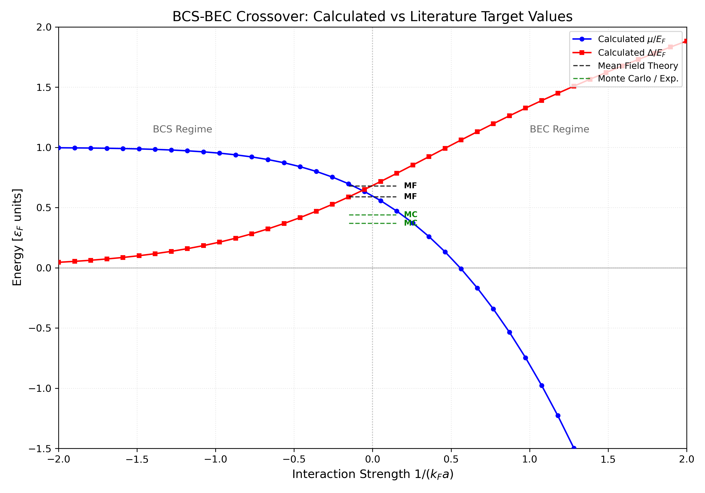

# BCS-BEC Crossover Simulation in 3D Fermi Gases

[](https://www.python.org/)

## Overview
This project simulates the **BCS-BEC Crossover** in a 3D ultracold Fermi gas at zero temperature ($T=0$). Using a mean-field approach, the software solves the coupled self-consistent equations to track the evolution of the system from weakly bound Cooper pairs (BCS limit) to a Bose-Einstein Condensate (BEC) of tightly bound dimers.

The transition is controlled by tuning the interaction strength via the dimensionless parameter $1/(k_F a)$, where $a$ is the s-wave scattering length.

> **Note on Project Scope:** This repository is not intended to provide a "perfect" or high-precision numerical solution for the unitary point. In the unitary regime ($1/k_Fa \approx 0$), advanced many-body methods such as Quantum Monte Carlo (QMC) or Extended BCS theories provide more accurate results than the standard mean-field approach used here. 
>
> The primary goal of this project is to study the **qualitative behavior** of the crossover through a **well-structured, reproducible, and professionally organized repository**, focusing on clean software practices applied to a complex physical problem.

---

## Physical Model

The simulation solves the mean-field equations for a continuum Fermi gas.

### 1. Excitation Spectrum
The energy of the quasiparticle excitations is given by:
$$E_k = \sqrt{(\epsilon_k - \mu)^2 + \Delta^2}$$
where $\epsilon_k = \frac{\hbar^2 k^2}{2m}$ is the single-particle kinetic energy.

### 2. The Regularized Gap Equation
In 3D, the contact interaction leads to a UV divergence. We implement a regularized version of the gap equation to ensure convergence:
$$\frac{m}{4\pi \hbar^2 a} = \int \frac{d^3k}{(2\pi)^3} \left( \frac{1}{2\epsilon_k} - \frac{1}{2E_k} \right)$$

### 3. The Number Equation
The total particle density $n$ is kept constant by solving for the chemical potential $\mu$:
$$n = \int \frac{d^3k}{(2\pi)^3} \left( 1 - \frac{\epsilon_k - \mu}{E_k} \right)$$

---

## Features
*   **Self-Consistent Solver**: Implements `scipy.optimize.root` with an iterative continuation method for high stability.
*   **UV Convergence**: Uses a subtraction scheme for the gap equation, making results independent of the high-momentum cutoff.
*   **Automatic Export**: Numerical data (`.txt`) and high-resolution plots (`.png`) are automatically saved to the `results/` folder.
*   **Dimensionless Units**: All results are normalized to the Fermi Energy $E_F$ and Fermi Momentum $k_F$.

---

## Project Structure
```text
├── src/
│   ├── config.py       # Physical constants (kF, EF, n)
│   ├── physics.py      # Integrals and Energy Spectrum
│   ├── solver.py       # Root-finding algorithm
│   └── plotting.py     # Visualization logic
├── results/            # Output: plots and numerical data
├── tests/              # Unit tests
├── main.py             # Main execution script
└── requirements.txt    # Dependencies (numpy, scipy, matplotlib)
```
## Goals

* Implement a numerical solver for the coupled equations
* Explore the crossover physics
* Produce plots of μ and Δ

---

## 3. Installation and Setup

Follow these steps to set up the project on your local machine:

### 1. Clone the repository
```bash
git clone https://github.com/valepioli/Software-project-many-body.git
cd Software-project-many-body
```
### 2. Install dependencies
```
pip install -r requirements.txt
```
---
## 3. Running the simulation
To execute the solver and generate the crossover data:
```
python3 main.py
```
## Outputs

Upon execution, the simulation automatically creates a `results/` directory containing the following files:

*   **`crossover_plot.png`**: A plot showing the evolution of the normalized Chemical Potential ($\mu/E_F$) and the Pairing Gap ($\Delta/E_F$) across the interaction range.
*   **`crossover_data.txt`**: A tab-separated text file containing the raw numerical results ($1/k_Fa$, $\mu/E_F$, $\Delta/E_F$) for use in external data analysis software.
## Expected Results

The simulation tracks the transition from the BCS limit to the BEC limit. The numerical results should match the standard mean-field benchmarks at zero temperature:
| Regime | Interaction ($1/k_Fa$) | $\mu / E_F$ | $\Delta / E_F$ | Physical Description |
| :--- | :---: | :---: | :---: | :--- |
| **BCS Limit** | $-2.0$ | $\approx 1.0$ | $\ll 1$ | Weakly interacting Cooper pairs |
| **Unitary Point** | $0.0$ | $\approx 0.37$ | $\approx 0.44$ | Scattering length $a \to \infty$ |
| **BEC Limit** | $+2.0$ | $< 0$ | $> 1.0$ | Tightly bound molecular dimers |

###  Physical Evolution
*   **Chemical Potential ($\mu$):** Starts at the Fermi energy ($\mu = E_F$) in the BCS regime, decreases as attraction increases, and crosses zero near the unitary point ($1/k_Fa \approx 0.55$ in mean-field). In the BEC limit, $\mu$ becomes deeply negative, approaching half the dimer binding energy: $\mu \to -1/2a^2$.
*   **Pairing Gap ($\Delta$):** Increases monotonically from the BCS to the BEC side, representing the transition from a soft pairing energy to a strong molecular binding energy.



---
## Status

Project started – work in progress.
