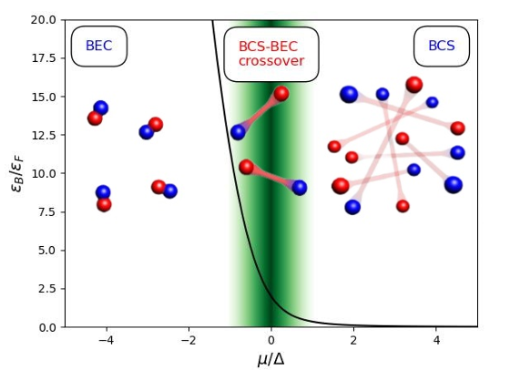
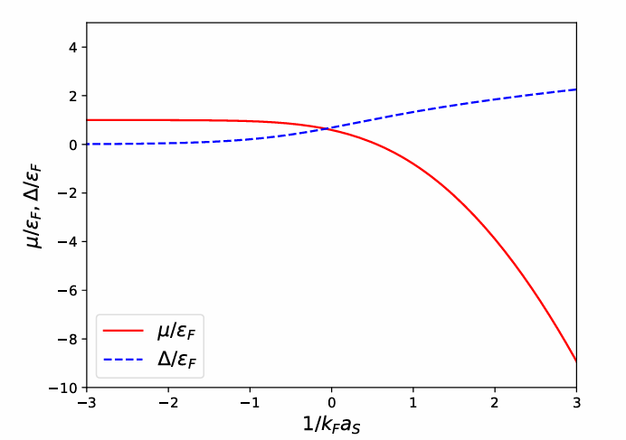
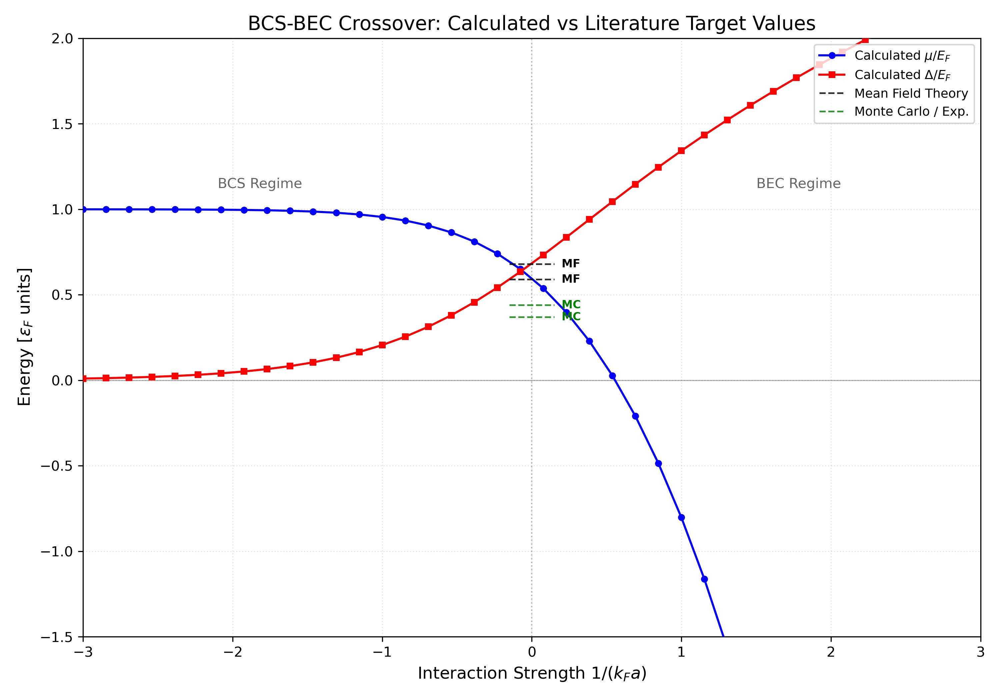
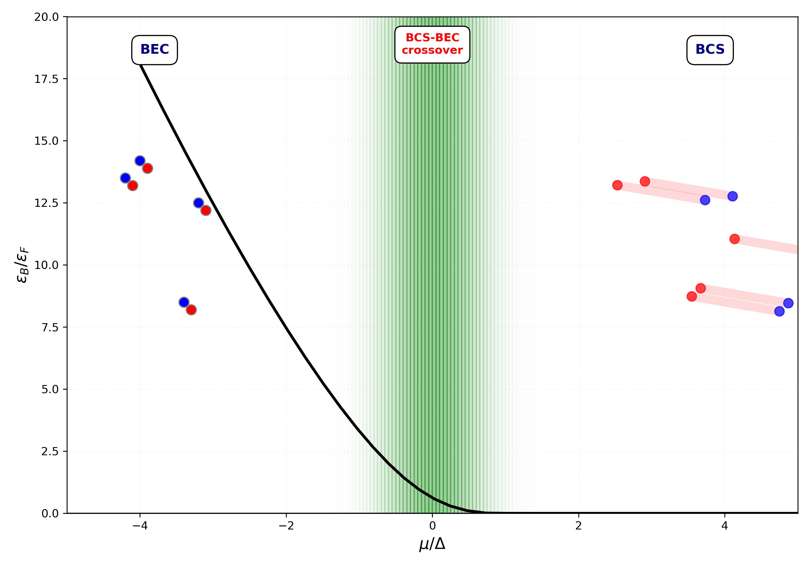

# BCS-BEC Crossover Simulation in 3D Fermi Gases

[](https://www.python.org/)

## Overview
This project simulates the **BCS-BEC Crossover** in a 3D ultracold Fermi gas at zero temperature ($T=0$). Using a mean-field approach, the software solves the coupled self-consistent equations to track the evolution of the system from weakly bound Cooper pairs (BCS limit) to a Bose-Einstein Condensate (BEC) of tightly bound dimers.
The transition is controlled by tuning the interaction strength via the dimensionless parameter $1/(k_F a)$, where $a$ is the s-wave scattering length.
It numerically reproduces the physical results and characteristic plots of the evolution of the chemical potential and pairing gap found in the literature, such as those presented in [**"BCS and BCS-BEC Crossover" by L. Lanaro**](https://materia.dfa.unipd.it/salasnich/phd/BCSandBCSBEC-Lanaro.pdf).

<p align="center">
  
  
</p>

> **Note on Project Scope:** This repository is not intended to provide a "perfect" or high-precision numerical solution for the unitary point. In the unitary regime ($1/k_Fa \approx 0$), advanced many-body methods such as Quantum Monte Carlo (QMC) or Extended BCS theories provide more accurate results than the standard mean-field approach used here. 
>
> The primary goal of this project is to study the **qualitative behavior** of the crossover through a **well-structured, reproducible, and professionally organized repository**, focusing on clean software practices applied to a complex physical problem.

---
# Theoretical Background: The BCS–BEC Crossover

## Ultracold Gas Context 

We study this model because it is directly relevant to **ultracold Fermi gases**, where the physics implemented in this code can be realized experimentally. In these systems, interactions are controlled via **Feshbach resonances**, allowing one to tune the dimensionless parameter:

$$\eta = \frac{1}{k_F a}$$

This enables direct exploration of the continuous crossover between BCS superfluidity and Bose–Einstein condensation (BEC), providing a realization of strongly correlated quantum matter.

---

## 1. Physical Regimes of the Crossover

The interaction strength is characterized by the s-wave scattering length ($a$) and the Fermi momentum ($k_F$). The system evolves smoothly across three main regimes:

| Regime | Parameter Range | Description |
| :--- | :--- | :--- |
| **BCS Regime** | $1/(k_F a) \ll -1$ | Weak attractive interaction; formation of large, overlapping Cooper pairs. $\mu \approx E_F > 0$. |
| **Unitary Regime** | $1/(k_F a) = 0$ | Scattering length diverges ($a \to \infty$); strongly interacting system with no intrinsic length scale. |
| **BEC Regime** | $1/(k_F a) \gg 1$ | Strong attraction; formation of tightly bound bosonic dimers. $\mu$ becomes negative ($2\mu \to -E_b$). |

---

## 2. Quasiparticle Excitation Spectrum

The paired state is described by **Bogoliubov quasiparticles** with the following dispersion relation:

$$E_k = \sqrt{(\epsilon_k - \mu)^2 + \Delta^2}$$

Where:
- $\epsilon_k = \frac{\hbar^2 k^2}{2m}$ is the kinetic energy.
- $\mu$ is the chemical potential.
- $\Delta$ is the pairing gap.

This spectrum defines the energy cost of breaking a pair and creating excitations.

---

## 3. Renormalized Gap Equation

A contact interaction in 3D leads to ultraviolet divergence. This is removed by expressing the interaction in terms of the physical scattering length $a$. The renormalized gap equation is:

$$-\frac{m}{4\pi \hbar^2 a} = \int \frac{d^3k}{(2\pi)^3} \left[ \frac{1}{2\epsilon_k} - \frac{1}{2E_k} \right]$$

### Interpretation
- $\frac{1}{2\epsilon_k} \rightarrow$ Vacuum two-body scattering.
- $\frac{1}{2E_k} \rightarrow$ Many-body contribution.

Each term diverges individually, but their difference is finite. This regularization ensures physically meaningful results when using a finite momentum cutoff in numerical simulations.

---

## 4. Number Equation

The density constraint is enforced through the number equation, which determines how particles occupy momentum states:

$$n = \int \frac{d^3k}{(2\pi)^3} \left[ 1 - \frac{\epsilon_k - \mu}{E_k} \right]$$

---

## 5. Numerical Solution

The system state is fully determined by solving the following two equations simultaneously:

1.  **Gap Equation**: Determines the pairing gap $\Delta$.
2.  **Number Equation**: Fixes the chemical potential $\mu$.

For a given interaction strength $1/(k_F a)$, the following conditions apply:
- $\mu$ and $\Delta$ are **nonlinearly coupled**.
- Both parameters appear inside the integrals within the quasiparticle spectrum $E_k$.
- No closed-form solution exists; the system must be solved numerically.
  
### 3. Structure of the repository
```text
├── src/
│   ├── config.py         # Global physical constants and grid parameters
│   ├── physics.py        # Physics engine: energy spectrum and regularized integrals
│   ├── solver.py         # Numerical engine: system of equations and root-finding
│   └── plotting.py       # Visualization functions (non-blocking)
├── results/              # Numerical data directory: stores crossover_data.txt
├── images/               # Visualization directory: stores .png plots
├── examples/             # Example images from the bibliography
├── tests/                # Software verification
│   ├── test_integrals.py # Tests for physical consistency of integrals
│   └── test_solver.py    # Tests for the gap solver
├── main.py               # Simulation entry point: runs the solver and saves data
├── plot_results.py       # Analysis entry point: loads data and generates/updates plots
├── requirements.txt      # Python dependencies (numpy, scipy, matplotlib)
├── .gitignore            # Rules for Git (ignores __pycache__, results/, etc.)
└── README.md             # Project documentation (Theoretical Background)
```
---
## Code Workflow

### 1. Initialization and Grid Setup
The script starts by loading physical parameters (density $n$, Fermi energy $E_F$) from `src/config.py`. 
*   **Units:** All energetic quantities are scaled by the Fermi energy $E_F = \frac{\hbar^2 k_F^2}{2m}$, and momenta are scaled by the Fermi momentum $k_F = (3\pi^2 n)^{1/3}$.
*   **Momentum Grid:** The script constructs a high-resolution grid in $k$-space and implement a large UV cutoff ($k_{max} \approx 100 k_F$). The integration measure is discretized as $dk \cdot k^2$ to account for the spherical symmetry of the 3D system.

### 2. Physical Engine (`src/physics.py`)
At the core of the project is the simultaneous solution of the **BCS Gap Equation** and the **Number Equation**. 

*   **UV Renormalization:** The bare contact interaction in 3D leads to a ultraviolet divergence in the gap equation. The code implements a **renormalization scheme** by subtracting the vacuum scattering contribution directly within the integral:
    $$\frac{1}{k_F a} = \frac{\pi}{2} \int_0^{\infty} dk \cdot k^2 \left[ \frac{1}{\sqrt{(\epsilon_k - \mu)^2 + \Delta^2}} - \frac{1}{\epsilon_k} \right]$$
    This regularization allows the solver to compute finite results without physical dependence on the arbitrary momentum cutoff.
*   **Density Constraint:** The number equation ensures particle conservation by relating the chemical potential $\mu$ and the gap $\Delta$ to the total density $n$:
    $$1 = \frac{3}{2} \int_0^{\infty} dk \cdot k^2 \left[ 1 - \frac{\epsilon_k - \mu}{\sqrt{(\epsilon_k - \mu)^2 + \Delta^2}} \right]$$
*   **Vectorization:** Integrals are computed using `numpy` vectorization over the $k$-grid for maximum performance.

### 3. Iterative Solving Logic (`src/solver.py`)
The system is described by two coupled, non-linear equations: $$\( f(\mu, \Delta) = 0 \)$$.

- **Numerical method:** We solve these equations using the [`hybr` method](https://docs.scipy.org/doc/scipy/reference/generated/scipy.optimize.root.html) from `scipy.optimize.root`. This method iteratively adjusts μ and Δ to reduce the residuals of both equations at the same time.

- **Constraints:** As the system approaches the BEC regime, its behavior changes significantly when μ crosses zero. To ensure physically meaningful solutions, Δ is kept strictly positive. This avoids the trivial solution (Δ = 0) and keeps the energy expression well-defined.

### 4. The Continuation Method (`main.py`)
Solving the equations for a specific interaction strength $1/k_F a$ often fails because the solver's radius of convergence is narrow. To map the entire crossover, we implement a **Numerical Continuation Method**:
1.  **Seed Solution:** The process begins in the **BCS Limit**, where the analytical approximations $\mu \approx E_F$ and $\Delta \to 0$ provide a robust initial guess.
2.  **Iterative Tracking:** The solver sweeps through interaction strengths in small increments $\delta(1/k_Fa)$. For each step $i$, the converged solution $\{\mu_{i-1}, \Delta_{i-1}\}$ is passed as the **initial guess** for step $i$.
3.  **Phase Transition Handling:** This "step-by-step" approach allows the code to smoothly track the solution into the **Unitary Limit** ($1/k_Fa = 0$) and deep into the **BEC regime**, where $\mu$ becomes large and negative.

## Goals

* Implement a numerical solver for the coupled equations
* Explore the crossover physics
* Produce plots of μ and Δ

---

## 3. Installation and Setup

Follow these steps to set up the project on your local machine:

### 1. Clone the repository
```bash
git clone https://github.com/valepioli/Software-project-many-body.git
cd Software-project-many-body
```
### 2. Install dependencies
```
pip install -r requirements.txt
```
---
## Usage and Command Line Interface (CLI)
The project is split into two independent phases. This allows you to update plot styles instantly without re-running the numerical calculations.
### Running the Simulation
This script solves the equations and saves the raw numerical results.
To run the simulation with the default configuration:
```bash
python3 main.py
```
## Customizing Parameters
This project uses `argparse` to allow users to interact with the simulation without modifying the source code. You can customize the numerical resolution and physical range directly from the terminal.
You can override the defaults using flags. This is useful for running quick tests with lower resolution or focusing on specific interaction ranges:
```
python main.py --n_points 500 --steps 10 --start_x -1.5 --end_x 1.5 --output custom_results
```
#### Available CLI Arguments:

| Argument | Description | Default Value |
| :--- | :--- | :--- |
| `--n_points` | Number of points in the momentum grid ($N$) | `10000` |
| `--k_max` | Momentum cutoff in units of $k_F$ | `100.0` |
| `--steps` | Number of steps in the interaction sweep | `40` |
| `--start_x` | Starting interaction strength $1/(k_F a)$ (BCS side) | `-3.0` |
| `--end_x` | Ending interaction strength $1/(k_F a)$ (BEC side) | `3.0` |
| `--output` | Directory name where results are saved | `results` |
| `--filename` | Name of file .txt output of the simulation | `crossover.txt` |


### Help Command
 To see the full list of parameters and their descriptions directly in your terminal, run:
```bash
python3 main.py --help
```

### Generating Plots (plot_results.py)
This script reads the data, normalizes it, and exports images.
To run the simulation with the default configuration:
```bash
python plot_results.py
```
## Custom execution
You can override the defaults using flags to plot different executions already created from the simulation.
```
python plot_results.py --data_dir "my_run" --data_file "high_res.txt" --output_dir "final_plots"
```

#### Available CLI Arguments:

| Argument | Description | Default Value |
| :--- | :--- | :--- |
| `--data_dir` | Folder where the .txt file is located | `results` |
| `--data_file` | Name of the file to analyze | `crossover_data.txt` |
| `--output_dir` | Folder where plots will be saved | `images` |


##  Outputs
Scripts automatically create output directories if they do not exist.

### 1. Numerical Results (`results/`)
*   **`crossover_data.txt`**: A tab-separated file containing the raw numerical results:
    *   Interaction strength ($1/k_F a$)
    *   Chemical potential ($\mu$)
    *   Pairing gap ($\Delta$)

### 2. Visualizations (`images/`)
*   **`crossover_plot.png`**: Normalized values of $\mu/E_F$ and $\Delta/E_F$ compared with literature benchmarks (Mean Field and Monte Carlo).
*   **`regimes_infographic.png`**: A trajectory plot showing the system transition through the crossover regimes as a function of the binding energy and the $\mu/\Delta$ ratio.


## Expected Results

The simulation tracks the transition from the BCS limit to the BEC limit. The numerical results should match the standard mean-field benchmarks at zero temperature:
| Regime | Interaction ($1/k_Fa$) | $\mu / E_F$ | $\Delta / E_F$ | Physical Description |
| :--- | :---: | :---: | :---: | :--- |
| **BCS Limit** | $-2.0$ | $\approx 1.0$ | $\ll 1$ | Weakly interacting Cooper pairs |
| **Unitary Point** | $0.0$ | $\approx 0.55$ | $\approx 0.69$ | Scattering length $a \to \infty$ |
| **BEC Limit** | $+2.0$ | $< 0$ | $> 1.0$ | Tightly bound molecular dimers |

###  Physical Evolution
*   **Chemical Potential ($\mu$):** Starts at the Fermi energy ($\mu = E_F$) in the BCS regime, decreases as attraction increases, and crosses zero near the unitary point ($1/k_Fa \approx 0.55$ in mean-field). In the BEC limit, $\mu$ becomes deeply negative, approaching half the dimer binding energy: $\mu \to -1/2a^2$.
*   **Pairing Gap ($\Delta$):** Increases monotonically from the BCS to the BEC side, representing the transition from a soft pairing energy to a strong molecular binding energy.



The following evolution is the expected physical result:

### 1. The Change in Pair Size
The crossover is fundamentally a competition between the **pair size** (coherence length) and the **inter-particle spacing**.
*   **On the BCS side ($1/k_Fa < 0$):** Pairs are large and overlapping. Pairing occurs in momentum space among fermions near the Fermi surface.
*   **On the BEC side ($1/k_Fa > 0$):** Pairs "shrink" into tightly bound dimers. These dimers are small enough to be treated as individual bosons in real space.

### 2. The Role of the Chemical Potential ($\mu$)
The ratio **$\mu/\Delta$** shown on the x-axis of the schematic is a key indicator of the regime:
*   **$\mu > 0$:** Indicates the existence of a Fermi surface (BCS-like).
*   **$\mu < 0$:** Indicates the "vacuum" of the constituent fermions; the particles are now entirely bound into bosonic molecules (BEC-like).

### 3. Smooth Transition
The image shows no "break" between these regimes. This confirms the **Crossover Hypothesis**: there is no phase transition between a BCS superconductor and a BEC condensate at $T=0$; they are two limits of the same underlying many-body state.



---
## Status

Project started – work in progress.
